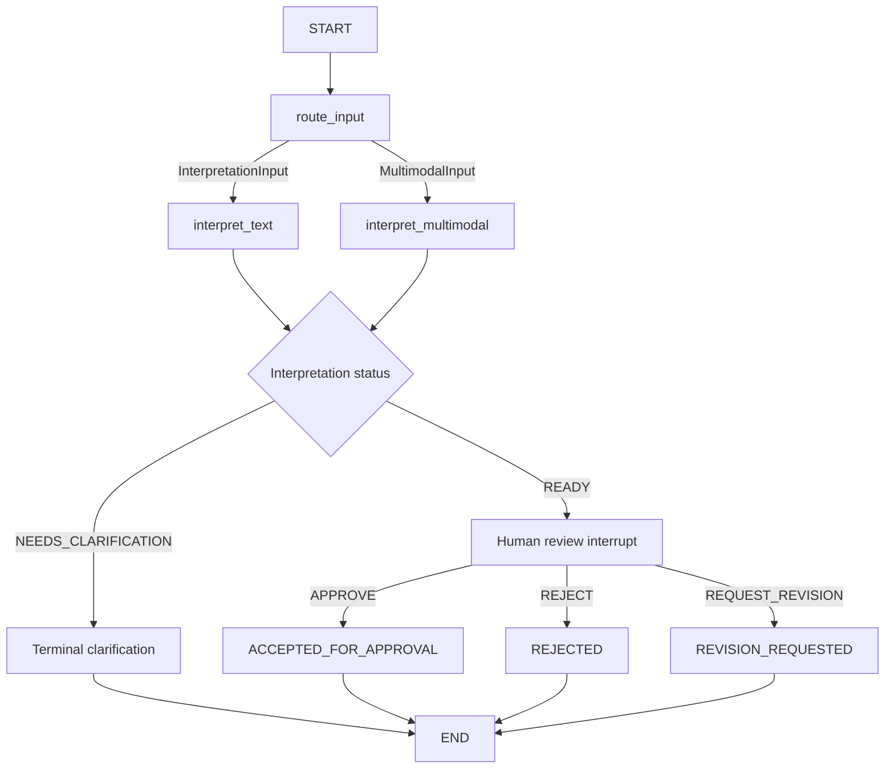

# Bounded agent orchestration

Phase 16 adds `quantlab.orchestration`: an explicit LangGraph state machine around
Phase 14 text interpretation and Phase 15 chart/text interpretation. LangGraph
controls workflow order, checkpointing and the human-review pause. It has no
financial authority. The only model boundary remains `quantlab.llm.LLMClient`.

## Topology and contracts



The status gate is a conditional edge after each interpretation node; review
decisions map deterministically to terminal statuses within the review node.
There are no hidden loops, dynamic destinations, generated tools, ReAct agents,
strategy searches or automatic revisions. A recursion limit of eight is an
additional runtime bound, not an invitation to iterate.

`OrchestrationRequest` contains a caller-assigned `thread_id` and exactly one
existing `InterpretationInput | MultimodalInput`. Input type determines routing.
There is no third strategy-input schema and no model-selected node name.
Identifiers reuse Phase 5's bounded identifier contract (1–128 characters).
All public models are strict, frozen, forbid extras, validate defaults and deeply
revalidate nested instances, including unchecked `model_copy` updates.

The public `WorkflowSnapshot` retains the original request, the unchanged complete
Phase 14/15 result, review binding, optional human decision and workflow status.
`route`, `proposal` and `clarifications` are derived properties. The proposal lives
only in the interpretation result; no competing strategy representation exists.
The approval-boundary statement and `phase5_approval_occurred=False` are explicit
contract fields. Workflow statuses are separate from interpretation and approval
enums. `INTERPRETING` is internal progress; successful calls return a paused or
terminal snapshot.

The internal typed `WorkflowState` contains one JSON-encoded snapshot, capped at
32 million characters to accommodate the existing bounded invocation artifact.
Every node and public checkpoint read reconstructs and deeply validates the
snapshot. JSON transport avoids checkpoint deserialization of arbitrary Python
domain objects. No LLM client, connection, checkpointer, callable or mutable quant
state is stored in graph state. Client and identity are construction-time closure
dependencies. Public snapshots never expose Pregel/runtime checkpoint metadata.

## Reuse and clarification

The text node calls `interpret_strategy`; the multimodal node calls
`interpret_multimodal_strategy`. Both use the original Phase 13 client. Phase 16
adds no prompt, schema for model output, conversion, feature vocabulary, image
transport, OCR, evidence policy or provider retry policy. Image order and original
inputs survive unchanged. Provider errors, cancellation, structured-output errors,
timeouts and retry limits retain their existing behavior. Graph nodes have no
additional retry policy. A failed invocation is not automatically restarted;
submit a new caller-owned workflow after handling the error.

`NEEDS_CLARIFICATION` ends without a review interrupt or proposal. Questions and
conflicts are retained exactly. There is no second provider call, invented answer,
automatic merge or mutation of input. A caller submits clarification answers or
revisions as a new Phase 14/15 input with a new workflow ID.

## Human review and Phase 5 approval

READY persists an `AWAITING_HUMAN_REVIEW` snapshot, then calls the real LangGraph
`interrupt()`. Its bounded JSON payload includes thread ID, strategy ID, version,
content digest, DRAFT state, source reference, interpretation route and review
instructions. Full text, raw provider output and image references are available
only through the deliberately retained application snapshot, not the interrupt
payload. The application must display the full proposal and evidence for review.

`HumanReviewDecision` requires the same thread, strategy ID, version and digest,
plus a `ReviewAction` enum: `APPROVE`, `REJECT`, or `REQUEST_REVISION`. The public
Python API rejects dictionaries, strings and truthy booleans as decisions. The
application constructs this model only after explicit human input. Phase 16
provides no reviewer authentication or UI and cannot prove that an application
caller is human. Thread identity is a binding, not an authorization token.

`resume_workflow` checks the current persisted snapshot and exact pending interrupt
before issuing `Command(resume=...)`. The resumed node validates the decision again.
The interpretation node is not re-executed on resume. Rejection and revision end
the workflow and preserve the original unapproved proposal for review.

APPROVE ends at **ACCEPTED_FOR_APPROVAL**. The proposal remains DRAFT, with no
approval record or generated timestamp. Phase 5's lifecycle is unchanged:
`mark_validated()` then `approve(ApprovalRecord(...))`, with caller-supplied reviewer,
aware review time, strategy ID, exact version and content digest. Phase 16 does
not invent these semantics or call either lifecycle transition. The backtester
continues to reject every Phase 16 proposal, including accepted proposals.

## API example

The following uses an application-supplied `LLMClient` backed by `FakeProvider`
and its matching `ModelIdentity`; no real provider or credentials are configured.
The scripted fake should contain a valid Phase 14 READY response as in the
offline test fixtures.

```python
from langgraph.checkpoint.memory import InMemorySaver
from quantlab.interpretation import InterpretationInput
from quantlab.orchestration import (
    HumanReviewDecision, OrchestrationRequest, ReviewAction, WorkflowStatus,
    build_research_graph, start_workflow, resume_workflow,
)

graph = build_research_graph(
    client=client, identity=model_identity, checkpointer=InMemorySaver(),
)
request = OrchestrationRequest(
    thread_id="research_16_example",
    input=InterpretationInput(
        strategy_text="Trade research:TEST on 1m bars, long only. Enter when close "
                      "crosses above SMA of 20 closes; exit when it crosses below. "
                      "No other restrictions.",
        input_reference="idea:example", strategy_id="sma_idea", version=1,
    ),
)
first = await start_workflow(graph, request)
if first.status is WorkflowStatus.AWAITING_HUMAN_REVIEW:
    # Display first.request, first.result, first.proposal and first.review.
    # Stop here until the application receives an explicit human choice.
    review = first.review
    # This example assumes the human explicitly selected APPROVE:
    answer = HumanReviewDecision(
        thread_id=review.thread_id, strategy_id=review.strategy_id,
        version=review.version, content_digest=review.content_digest,
        action=ReviewAction.APPROVE,
    )
    final = await resume_workflow(graph, thread_id=request.thread_id, decision=answer)
    assert final.status is WorkflowStatus.ACCEPTED_FOR_APPROVAL
    assert final.proposal.approval is None
```

## Checkpoints, replay and trust boundaries

Each build creates a fresh `InMemorySaver` unless the application supplies one.
Use one saver per handle/workflow namespace and a fresh saver per test. Different
IDs within one handle remain isolated; duplicate starts and repeated terminal
resumes fail. Calls on a handle are serialized with an async lock, covering the
check-and-invoke sequence. Use a handle from one event loop and do not share its
saver among handles, processes or concurrent external writers.

Checkpointer persistence is **not long-term application persistence**. State is
lost when the in-memory saver is discarded. Storage is trusted application-owned
memory, without authentication, encryption, durable recovery, retention/cleanup
policy or cross-process coordination. Keep handles/checkpointers and LangGraph
internals away from untrusted callers. Checkpoint histories consume memory until
the application discards the namespace; no global saver or generic memory exists.
LangGraph itself generates internal checkpoint/run metadata (IDs and times);
these are never used as domain identity, approval metadata or business state.

Replay validation reuses Phase 14/15 validators to rebuild the expected invocation,
reparse the structured response and reconstruct the original proposal. Additional
checks bind input type/content and image ordering to the interpretation artifact,
then strategy ID/version/digest to review payload and human decision. Corrupted
copies, mismatched threads, altered proposals and stale decisions fail closed
with sanitized orchestration errors. Invalid decisions are checked before resume,
so they do not consume the pending interrupt. Errors do not interpolate inputs,
image references, raw provider responses or credentials.

These checks establish consistency, not cryptographic authenticity. A trusted
process that replaces every record consistently is outside this boundary.
Human authentication, durable tamper-evident storage and semantic accuracy of model
interpretations remain separate concerns. A genuine quote can still support an
incorrect interpretation; a visual observation is never a market-data record.

## Dependencies and offline behavior

`pyproject.toml` directly adds only `langgraph>=1.2.12,<2`, using the repository's
existing bounded-version convention. Python 3.11.9 and LangGraph 1.2.12 were used
for verification. LangGraph requires `langchain-core` and a transitive `langsmith`
distribution; Phase 16 imports neither package, uses no LangChain model wrappers,
creates no LangSmith client and requires no account or service.

The application API refuses enabled `LANGSMITH_TRACING`, `LANGSMITH_TRACING_V2`,
`LANGCHAIN_TRACING`, `LANGCHAIN_TRACING_V2`, or `LANGCHAIN_HANDLER` flags with a
sanitized input error before invocation. Flags must be absent, empty, `false` or
`0`. Only these non-secret flags are inspected; API keys and credentials are not
read. The API never changes the environment. Invocations run in a fresh context
with empty callbacks, isolating inherited tracing/runnable configuration. The
host must keep tracing disabled throughout execution; do not mutate process-wide
runtime configuration concurrently. No automatic tracing/telemetry is enabled.

Future local Qwen/Qwen3-VL/Ollama or cloud adapters implement the existing Phase 13
provider protocol and capabilities. The graph's business logic does not change.
Real adapters and model quality evaluation are deferred.

## Verification and extension points

`tests/orchestration` executes the real StateGraph, START/END, interrupt, Command
and InMemorySaver offline. Coverage includes both routes, all review outcomes,
terminal clarification/conflicts, exact invocation preservation, deep/frozen
contracts, replay forgery, checkpoint isolation, concurrent duplicate calls,
Phase 13 retries/errors and rejected backtester use of unapproved proposals.
Import and AST checks prohibit vendor SDKs, executable content, quant execution
and future application layers. Runtime tests deny file/network access, credential
reads, market-record construction, approval transitions, backtests, risk,
analytics and ML training while normal workflows still complete.

Run `python -m pytest tests/orchestration -q`, then
`python -m pytest tests/llm tests/interpretation tests/orchestration -q`, then
`python -m pytest -q`.

Phase 17 may add explicit bounded MCP tool nodes after appropriate deterministic
service gates. No MCP server, client or tool exists in this package. No quant
engine executes in Phase 16. Paper trading (18), portfolio (19), journal (20),
FastAPI (21), frontend (22), full E2E integration (23), deployment (24) and final
demo polish (25) remain planned. Production checkpointers, queues, long-term memory,
autonomous search/optimization, self-modifying strategies and real-money execution
are also deferred.

Runtime references: [LangGraph interrupts and resume](https://docs.langchain.com/oss/python/langgraph/interrupts)
and [the official package](https://pypi.org/project/langgraph/).
