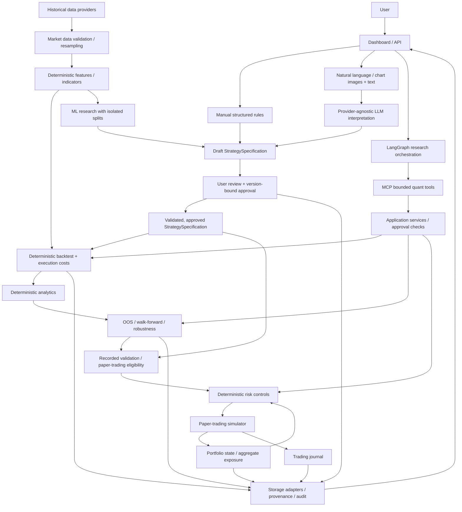

# Architecture

**Status: Phases 1–13 implemented; subsequent functional layers are planned.** This document is the current architectural source of truth. The existing implementation consists of the package/configuration foundation, market-data domain contracts, the isolated Dukascopy historical quote-ingestion adapter, Phase 4 validation, UTC resampling, local dataset storage, Phase 5 strategy specification contracts, the Phase 6 causal feature engine, and the Phase 7 deterministic research backtester with Phase 8 execution costs, Phase 9 performance analytics, Phase 10 research validation, Phase 11 deterministic entry risk, Phase 12 offline ML research and Phase 13 provider-neutral LLM infrastructure described below. Layer names in the planned architecture describe responsibilities, not a complete module tree already present in the repository.

## Goals and boundaries

The platform will support reproducible quantitative research from human-authored ideas through historical testing, validation, and controlled paper trading. Users will supply structured rules, natural language, or one or multiple chart images with text explanations. Each route will converge on a common StrategySpecification before execution.

Forex is the first detailed market implementation. Instrument, timestamp, execution, currency, and data contracts must support later equities and crypto adapters without rewriting the core. The design favors a modular Python core with explicit interfaces; separate services are not required initially.

In scope for the planned first-generation platform: data ingestion and quality checks, strategy definitions, deterministic quant engines, research validation, ML experiments, AI-assisted interpretation, agent orchestration, MCP tools, risk, paper trading, portfolios, journaling, and a separate API/dashboard.

Outside current scope: real-money brokerage execution, autonomous strategy deployment, guaranteed profitability, and V2 self-evolving alpha research. Phases 2–4 implement market-data domain contracts, historical quote ingestion, quality checks, UTC aggregation, and local storage; Phase 5 adds strategy specification contracts and Phase 6 implements feature computation and Phase 7 adds approved-strategy research backtesting and Phase 8 adds deterministic execution costs and Phase 9 adds performance analytics and Phase 10 adds chronological research validation and Phase 11 adds mandatory deterministic entry risk and Phase 12 adds offline ML research; the other functional layers remain unimplemented. AI output and screenshots are research inputs, not authoritative historical prices or approved execution instructions.

## Implemented Phase 2 contracts

The public contracts live in `src/quantlab/data/` and are exported by `quantlab.data`. They depend only on the standard library and Pydantic.

| Contract | Current responsibility |
| --- | --- |
| Instrument | Stable domain identity, symbol, asset class, quote/base currency labels, price/quantity increments, contract multiplier, and calendar reference. Forex requires distinct three-letter base/quote codes plus explicit pip and lot sizes; pip size cannot be smaller than tick size. |
| TradingCalendar | Calendar identity and descriptive IANA timezone label. This is a reference only: timezone resolution, session/holiday schedules, and calendar correctness are deferred to an adapter. |
| MarketBar | Complete OHLC observation with explicit price basis, timeframe label, half-open start/end interval, earliest availability time, source/dataset references, and optional volume with explicit units. |
| MarketQuote | Timestamped bid/ask observation with earliest availability time and instrument/source/dataset references. Locked quotes are accepted; crossed quotes are rejected. |
| Enums | AssetClass (Forex, equity, crypto), PriceType (bid, ask, mid, trade), initial Timeframe labels (1m, 5m, 15m, 30m, 1h, 4h, 1d, 1w), and VolumeType (base, quote, tick count). |

Models are immutable, reject extra fields, and use strict Python construction: callers supply Decimal values, datetime objects, and enum members. JSON serialization/validation supports their corresponding wire representations; see [Pydantic strict-mode semantics](https://docs.pydantic.dev/latest/concepts/strict_mode/). Currency labels are validated syntactically, not against a currency registry. Crypto codes may be longer than three characters; non-Forex instruments do not use pip/Forex-lot metadata.

All observation timestamps require timezone information and normalize to UTC. Preserve the source's timezone context separately through instrument/calendar metadata when needed. Bar availability cannot precede the end of its interval; quote availability cannot precede its observation timestamp. OHLC values must lie within low/high bounds, quotes require ask >= bid, and prices must be finite and positive for the initially supported asset classes. Negative-priced instruments would require an explicit future contract change.

Missing volume is None, distinct from zero. Supplied volume must be finite and nonnegative, accompanied by its unit type; tick-count volume must be integral. Quantity increments, pip sizes, lot sizes, and contract multipliers are metadata, not sizing or valuation calculations.

Timeframe labels do not generate schedules or enforce fixed elapsed durations: explicit bar endpoints support session/DST differences. Instrument and source/dataset identifiers are opaque references. Phase 3 adds historical quote ingestion; Phase 4 adds dataset quality checks, UTC resampling, and local storage below. Calendar adapters, source registry lookup, and price-grid alignment remain deferred.

## Implemented Phase 3 ingestion

`quantlab.data.providers.base` defines a quote-only HistoricalQuoteRequest and HistoricalQuoteProvider protocol. Requests supply an Instrument plus timezone-aware start/end datetimes; inputs normalize to UTC and use **[start_time, end_time)**. The interface returns an iterator of canonical MarketQuote objects. It does not expose binary formats, provider symbols, bar requests, dataframes, or persistence to consumers.

The first concrete adapter is `quantlab.data.providers.dukascopy.DukascopyProvider`. It separates request validation, an injectable ByteFetcher transport, isolated binary decoding, and canonical-model translation. The standard-library HTTP transport uses urllib with a configurable finite timeout and bounded response reads. There are no credentials, retries, import-time requests, caches, or file writes on this selected public-data path.

### Selected format and support boundary

The [official historical-data guide](https://www.dukascopy.com/wiki/en/development/data-export/) describes the 20-byte big-endian tick fields and price scales, and warns about different hourly/daily time bases. The [official support archive](https://www.dukascopy.com/swiss/english/forex/jforex/forum/viewtopic.php?p=76043) records hourly public datafeed paths. **This adapter selects the public hourly archive, not the daily Requester Pays S3 layout currently described in the guide.** It does not guess a layout from payload contents or switch between variants.

- Endpoint: `https://datafeed.dukascopy.com/datafeed/{SYMBOL}/{YYYY}/{MM}/{DD}/{HH}h_ticks.bi5`. The month is zero-based; day/hour are conventional UTC fields.
- Accepted compression: one legacy LZMA-Alone stream (`lzma.FORMAT_ALONE`). XZ, headerless raw LZMA, trailing bytes, concatenated streams, and incomplete streams are rejected. Decompression has output and decoder-memory limits.
- Each decompressed record is `>IIIff`: uint32 milliseconds since the requested UTC hour began, uint32 ask, uint32 bid, float32 ask volume, float32 bid volume. A partial record or offset outside that hour is rejected.
- Initial explicit pair registry: EUR/USD → EURUSD with point size 0.00001; USD/JPY → USDJPY with point size 0.001. Other instruments/pairs are rejected until added explicitly.
- Canonical prices equal the native integer times Instrument.tick_size. The adapter requires that metadata to match the registered provider point size, so a coarser broker tick size cannot silently change prices. Scaling uses a fixed local Decimal context; it does not inspect display strings or assume a universal divisor.
- Provider volume fields are checked for finite, nonnegative values. They are not mapped because the existing MarketQuote contract has no volume fields; no Phase 2 model was changed.

These are the adapter's explicit accepted format assumptions. A small manual live probe received HTTP 429, so successful live compatibility was not verified during this phase. Offline tests establish the selected binary/transport contract; they do not establish endpoint uptime or complete historical coverage. Daily S3 ingestion and undocumented format variations remain unsupported.

### Canonical mapping, absence, and errors

Each tick maps to a MarketQuote with the requested instrument_id, Decimal bid/ask, and a timezone-aware UTC timestamp reconstructed from the hour plus the millisecond offset. The existing model enforces positive prices and ask >= bid. source_id is `dukascopy`; dataset_id includes the provider symbol, UTC file hour, and SHA-256 hash of the compressed payload. These are source references, not database IDs.

**Initial availability policy:** available_at equals the historical tick timestamp and represents source event availability. It does not represent download time or a guarantee of zero publication/network latency. Later live/paper-trading adapters and execution simulations must specify additional latency explicitly.

A transport result of None denotes an absent resource; the default transport returns it for HTTP 404. The adapter also treats an empty successful body or a valid zero-record stream as an explicit no-observation result. This is an ingestion policy, not proof of a weekend/holiday or a claim of complete coverage. Nothing is filled or fabricated. Nonempty corrupt payloads and invalid canonical quotes raise ProviderDataError, including malformed records outside the requested subrange of a downloaded hour.

HTTP/network failures raise ProviderTransportError with status/retryability information when available. HTTP 429 and 5xx are classified as retryable but are not automatically retried. Unsupported pairs or mismatched scale metadata raise ProviderConfigurationError before HTTP access. HTTP 403 is an error, not a missing dataset.

Fetching is lazy and visits only intersecting UTC hours. It preserves record order and duplicates without sorting or cleaning. Each file is fully decoded and mapped before any of its quotes are yielded; earlier hours may already have been emitted if a later hour fails. Consumers must treat exceptions as an incomplete request, not a successful sparse dataset.

### Licensing and next boundary

Users must comply with Dukascopy's applicable historical-data terms/licensing, including any restrictions on use or redistribution. Public accessibility does not automatically grant redistribution rights. Tests construct tiny synthetic binary payloads; no provider dataset is checked into the repository.

Phase 4 implements dataset-wide quality checks, chronological/duplicate/gap validation, missing-period reports, resampling/OHLC aggregation, and normalized storage outside this provider adapter. This adapter has no dataframe processing, filesystem persistence, backtesting, or execution behavior.

## Implemented Phase 4 datasets

The provider-neutral public API adds DataQualityReport, ValidationOptions,
validate_dataset, normalize_observations, ResampleRequest/resample,
DatasetMetadata, DatasetStore, and SQLiteDatasetStore. Quality types stay in
validation.py because the report and checks form one small contract. The existing
Phase 4 test_pipeline.py holds focused behavioral cases and the synthetic provider
integration, keeping shared fixtures and end-to-end coverage together. No later
functional layer or provider rewrite is part of this implementation.

### Quality and explicit normalization

DataQualityReport is a strict immutable Pydantic model containing observation,
exact-duplicate, repeated-timestamp, adjacent out-of-order, non-monotonic, and gap
counts; chronological first/last event timestamps; warnings/errors; validity;
and whether gap checks ran. Every observation is revalidated, including objects
made by unchecked Pydantic construction/copy. Existing domain validation checks
OHLC, finite positive prices, quote bounds, volume units, timezone awareness,
and availability. Sequence checks cover instrument identity, mixed quote/bar
kinds, mixed bar price basis/timeframe, and bar overlap. Inputs are not mutated,
sorted, repaired, deduplicated, or filled during validation.

An exact duplicate includes all canonical fields, including provenance and
availability. Counts measure occurrences after the first matching observation;
repeated timestamps are counted separately. out_of_order_count counts adjacent
valid event-time decreases; non_monotonic_count counts adjacent <= comparisons.
Repeated quote timestamps are errors even if prices differ: resampling rejects
ambiguous event ordering without a source sequence. Source homogeneity defaults
on. Dataset homogeneity defaults off because Dukascopy versions hourly files
independently; ValidationOptions can enforce it or an explicit source/dataset ID.
Empty input is an explicit warning with no fabricated timestamps or coverage.

Quotes are irregular events. ValidationOptions.max_gap optionally sets the
maximum consecutive event-time separation, with gaps strictly greater than the
positive threshold reported as errors. No tick cadence is assumed. Optional
expected_starts provides a caller-owned bar/session schedule, reporting missing
and unexpected starts including leading/trailing gaps. Closures must be excluded
by the caller. Without either option, gaps_checked is false. These checks are
quality diagnostics, not proof of provider completeness. Price-grid alignment
and calendar/session adapters remain deferred.

normalize_observations is opt-in, returns a tuple, and performs a stable time
sort. DuplicatePolicy.KEEP/REJECT/REMOVE affects exact duplicates only; REJECT
is the default. Distinct observations at identical timestamps remain in original
relative order and are still rejected by resampling. No input sequence is mutated.

### UTC causal resampling

ResampleRequest requires an instrument, explicit price basis, timeframe, aware
start/end timestamps, and MissingDataPolicy. The implementation uses fixed UTC,
left-labelled [start, end) intervals. M1/M5/M15/M30/H1/H4 use minute/hour alignment;
D1 uses midnight UTC and the optional W1 convention is Monday 00:00 UTC with a
fixed seven-day duration. Daily/weekly bars describe UTC windows only, never
Forex sessions, holidays, or exchange calendar days. No machine-local timezone
is used. Request endpoints must align to whole target intervals; partial request
edges and out-of-window observations are rejected.

BID and ASK select quote prices; MID is per-event Decimal (bid + ask) / 2. Quotes
cannot produce TRADE bars. OHLC uses first observation, maximum, minimum, and last
observation respectively. A quote at a right boundary belongs to the next bar.
Input must pass structural/chronological validation; resampling never silently
normalizes it. Quote-derived volume and volume_type are both None because the
canonical quote has no volume. No observation counts are presented as volume.

Empty bins are omitted or rejected by the explicit policy. No carry-forward,
forward-fill, interpolation, or invented observations/bars occurs. A nonempty
quote bin alone does not prove complete coverage. Optional bar coarsening retains
the existing Phase 4 behavior: a single price basis/timeframe/source, integral
coarsening, aligned fixed-duration inputs, and contiguous complete coverage.
Partial bar groups are omitted or rejected, never bridged. There is no upsampling
or splitting. Volumes sum only when every member supplies compatible units;
missing volume remains None and conflicting units are rejected.

The exact availability rule is:

`available_at = max(bar.end_time, *(member.available_at for member in members))`

No completed bar is usable before interval end; delayed input availability
propagates. Decimal calculations use a local context sized to input values,
independent of caller precision. The derived observation dataset_id hashes the
utc-ohlc-v2 transformation, request parameters, and ordered canonical inputs,
including their originating dataset references. Future bins cannot alter earlier
OHLC or availability, though the full dataset content identity can change.

### Local storage and reproducibility

Canonical Python model sequences are sufficient here; no dataframe dependency
is introduced. Pandas versus Polars and columnar export remain open pending
measured performance needs. SQLite is the selected portable single-file local
format: Python's standard-library sqlite3 provides transactions across records,
metadata and reports, preventing partially published datasets without adding
libraries or a database service. The configured path must have an existing parent
directory. No PostgreSQL, cloud adapter, pickle, or network access is involved.

DatasetMetadata retains instrument metadata, source/provider, instrument_id,
quote/bar type, timeframe/price_type for bars, record count, UTC bounds, created_at,
transformation identity/version, optional parent IDs, validation policy/schedule,
and caller-supplied description/licensing. Saving derives fields from observations
and rejects conflicting declarations. Quote bounds mean first and last events
(inclusive); bar bounds mean first start through last end (exclusive end). Empty
datasets require explicit source/type and, for bars, timeframe/price basis; their
bounds can be absent or explicitly supplied. Empty warnings may be retained, but
all quality errors reject a save before the file is opened.

SQLite separates metadata/reports from ordered typed observation columns.
Decimal values use TEXT, UTC datetimes use ISO strings, and enums retain their
wire values. Each record's source_id/dataset_id is preserved. The stored dataset
identity is separate: SHA-256 of schema version, canonical serialized metadata,
ordered records, and quality report, excluding dataset_id itself and created_at.
Creation time is audit metadata, not part of reproducible identity or its digest
integrity guarantee. The first save's timestamp is retained for repeated saves.
Changed records, transformation versions, parents, or other content metadata
produce a new identity. Parent IDs are references, not an enforced lineage graph;
callers save source observations separately and record exact transformation
parameters when they need a reproducible derivation chain.

A dataset save is one SQLite transaction. Failed insertions roll back the entire
version. Existing identical versions are verified and returned without overwrite;
corrupted versions are rejected. Loads use a read-only consistent snapshot and
verify schema, typed metadata/report, positions/count, canonical models, quality,
derived metadata consistency, and content hash. Unsupported schema versions are
rejected without migration. There is no import-time file access, deletion API,
raw .bi5 payload retention, or redistribution authorization. Local artifacts stay
outside Git; all persistence tests use temporary directories and synthetic data.

## Implemented Phase 6 features

quantlab.features adds immutable typed definitions, requests, integer parameters
and Decimal observations; a fixed read-only registry; a deterministic indicator
dispatcher; and a validated multi-feature batch pipeline. Phase 4 validation is
reused with explicit Instrument metadata. Gaps and multiple source references
are allowed, while malformed, mixed or unordered bar series are rejected.

The initial set is raw OHLC, simple/log returns, SMA, SMA-seeded EMA, Wilder RSI
and unannualized population volatility of simple returns. Calculations use an
isolated 34-digit Decimal context, including native ln/sqrt. Warm-up observations
are omitted. Timestamps label the ending bar end; availability covers every
contributing input. EMA/RSI retain prefix availability; rolling dependencies expire
as inputs leave the window.

The pipeline preserves identities/parameters, shares simple returns and identical
computations, and orders output by timestamp and feature ID. Structural strategy
compatibility checks exact registry IDs, INDICATOR type, arguments and matching
timeframe overrides without evaluating rules or altering approval. Pipeline
aliases do not automatically bind strategy aliases. No dynamic plugins,
cross-timeframe joins, persistence or execution are added. See
[feature-engine.md](feature-engine.md) for formulas, examples and limitations.

## Implemented Phase 7 backtesting

quantlab.backtesting consumes an exact-version APPROVED StrategySpecification,
canonical MarketBar inputs, supplied Phase 6 FeatureObservation values, explicit
Instrument metadata and a strict BacktestConfig. It reuses Phase 4 dataset checks,
Phase 5 approval/schema validation, and Phase 6 feature compatibility. Unsupported
stop_loss, take_profit, session, sizing_reference, BID/ASK operands, multi-instrument
strategies and unavailable registry feature categories are rejected explicitly.

The bar loop executes a pending action at the following input bar open before
evaluating that bar close. Declarative comparisons, ALL/ANY and crossings use
TRUE/FALSE/UNAVAILABLE, exact bar-relative feature timestamps and availability
no later than decision time. Missing history is never filled. BOTH conflicts fail.
One fixed-quantity position is allowed, with no pyramiding, same-open reversal or
forced end-of-data liquidation. Final signals without a following bar stay unfilled.

Frozen signals, fills, positions, closed trades, equity points and BacktestResult
retain deterministic identities and Decimal financial values. Research equity is
initial capital + realized P&L + close-marked unrealized P&L; this does not debit
entry capital or model brokerage cash/margin. Arithmetic uses an isolated 34-digit
Decimal context. Quantity must respect existing quantity_increment metadata.
Phase 8 extends the next-open fill boundary in execution.py, described below.
Historical close marks are retrospective reporting; complete bar availability gates
decisions, not the assumed next-open fill.

[Backtesting contracts and examples](backtesting-engine.md) define causality,
validation, accounting and limitations. Phase 9 analytics consumes these completed results separately; Phase 11 enforces entry risk before execution pricing.

## Implemented Phase 8 execution costs

BacktestConfig nests a frozen strict ExecutionCostConfig with zero defaults.
execution.py owns only next-open price/cost calculation; RuleEvaluator remains
unchanged, and engine.py owns position/accounting updates. The result retains
the execution configuration. Fills expose causal reference opens, actual prices,
price-unit adjustments and immutable CostBreakdown components. Positions retain
entry references/costs; trades expose reference gross, execution gross and net P&L.

MID buys/sells use half-spread; BID buys and ASK sells use full spread, while
BID sells and ASK buys use none. TRADE bars reject nonzero synthetic spread.
Fixed adverse slippage increases buys and decreases sells. Commission scales
with quantity; fixed fees apply per actual fill. Spread/slippage affect prices
and are never separately debited from gross P&L. Entry explicit cash costs
are recognized immediately; exits realize execution P&L and debit only exit cash costs.
Equity remains initial capital + realized account P&L + close-marked unrealized P&L.
Open positions have no fabricated exit costs; final unfilled signals incur none.

Cost arithmetic and validators use isolated 34-digit ROUND_HALF_EVEN Decimal
contexts. Price effects/accounting that cannot reconcile at this precision fail
explicitly. Existing quantity-step checks, zero-cost economics, causality,
no same-open reversal, input immutability and network isolation are preserved.
No microstructure, financing, account-currency conversion, portfolio, risk or
analytics framework is introduced. See [the permanent cost specification](execution-cost-model.md).

## Implemented Phase 9 performance analytics

quantlab.analytics consumes BacktestResult without changing simulation or execution.
Frozen strict PerformanceReport records strategy/version/digest, instrument/timeframe/
price basis, explicit analytics config and authoritative ending account values.
Nested trade statistics use closed net_pnl only; account returns use final equity,
including open-position marks and already-paid entry explicit costs.

The layer reports capital-relative return, consecutive equity returns (including
the first mark), population volatility, per-period Sharpe and optional explicitly
annualized Sharpe. It never infers a calendar factor. Drawdowns include the initial
capital peak and retain both independent maxima and observed recovery episodes.
Holding and underwater durations use elapsed timestamp differences. Undefined
metrics use None, including affected return periods after nonpositive prior equity.

The public boundary revalidates nested input contracts, equity chronology, account
identities and ending mark agreement without repairing or replaying input. Fresh
34-digit ROUND_HALF_EVEN Decimal contexts isolate caller settings. No dependencies,
network activity, randomness, risk controls, robustness assessment or strategy
scoring are added. See [the metric specification](performance-analytics.md).

## Implemented Phase 10 research validation

quantlab.validation orchestrates existing run_backtest and analyze_performance calls
without changing their formulas or approvals. models.py holds strict immutable
windows/configs/results; splits.py plans half-open bar-count holdouts and complete
rolling/expanding folds; runner.py validates full causal feature dependencies before
slicing and executes flat independent segments; robustness.py evaluates explicitly
approved parameter-default variants; _summary.py computes descriptive Decimal
statistics; errors.py distinguishes input and compatibility failures.

No final-bar signal fills in another segment. Historical prepared indicator context
is allowed; rule offsets/crossings restart within each segment. Full history must
cover supplied feature input_start metadata, including delayed dependencies. Shared
cost/analytics configuration is retained in reports. OOS aggregates do not compound
independent equity curves. Parameter variants require separate exact-version
approval and fixed structure; no runtime override, ranking or fitting is added.
Regime/session analysis, label purge/embargo and subsequent phases remain
planned. Phase 11 risk policies propagate through the existing BacktestConfig. See [complete Phase 10 policies](research-validation.md).

## Implemented Phase 11 deterministic risk

quantlab.risk supplies frozen strict RiskConfig, RiskContext and RiskDecision,
ALLOW/REJECT actions, stable reasons and pure evaluate_entry_risk. BacktestConfig
nests the policy; all five optional limits default to None. The backtester owns
account state and a fresh runtime peak for each run. Every entry at the next open
is evaluated before execution pricing/costs; rejection consumes intent, retains
the Signal, and creates no fill or costs. Exits bypass entry gating and there is
no forced liquidation or quantity reduction. Results retain policy and decisions.

Quantity, unsigned reference-open notional and equity-fraction caps allow exact
equality. Minimum equity and peak-relative drawdown block at equality. Runtime
peak uses initial capital, prior on-time close equity and current flat pre-entry
equity; delayed retrospective marks never enter risk state, even after publication.
Exact integer-ratio comparisons of Decimal values enforce boundaries independently
of caller context; account/cost arithmetic retains isolated precision 34. Phase 10
reuses the policy with independent segment/fold/candidate peaks. Capital-at-risk is
deferred because stops remain unsupported; daily/session, portfolio, margin and
dynamic sizing controls are not introduced. See [risk-engine.md](risk-engine.md).

## Implemented Phase 12 offline ML research

quantlab.ml constructs supervised rows from explicit ordered Phase 6 declarations,
canonical observations and Phase 10 ValidationWindow indices. Exact-time causal joins
omit missing/delayed inputs. Window-local forward-return labels never enter feature
columns; final horizon rows and labels unavailable by training-window close are purged.
A deterministic positive-penalty ridge regression uses standard-library exact fractions
for fitting and isolated 34-digit Decimal coefficients/inference. No dependency,
randomness, scaling, model selection or network operation is introduced.

Frozen phase12-v1 artifacts retain the full schema/config, training decision bounds,
conservative information cutoff including label publication, count, source-data digest,
coefficients/intercept and a canonical SHA-256 model identity. Inference accepts only
unlabeled exact-schema datasets strictly after the training cutoff. Predictions become
canonical FeatureObservation objects with stable ml_forward_return_v1 implementation
and a complete model-digest integer parameter. The existing ML_SIGNAL category now
accepts only that bounded declaration; changing models changes strategy approval content.
The ordinary backtester, cost model, analytics and risk engine remain authoritative.

No ML API constructs a strategy, approval, Fill, Position or ClosedTrade. Callers can
reuse Phase 10 windows for independent fitting; automated ML holdout/walk-forward
orchestration, tuning and broader models are deferred. See [ml-research.md](ml-research.md)
for provenance, exact numerical policies, limitations and the complete workflow.

## Planned system flow

Arrows represent information/control flow, not Python import direction. Every execution entry point, including internal application services and MCP tools, must enforce the same approval and risk rules. The diagram is conceptual; no network services or tools exist yet.

## Architectural layers

### Market data

Own canonical instrument metadata and time-indexed market observations, ingestion adapters, dataset provenance, and quality reports. Record provider, instrument identity, timestamp semantics, timezone, granularity, price type (bid, ask, mid, trade), units, and source/version identifiers.

Forex contracts must describe base/quote currencies, tick and pip sizes, trading calendar, and available bid/ask information. Core contracts should not assume every market uses pips, continuous sessions, or a particular lot size. Preserve raw input separately from normalized datasets; transformations must be traceable.

Normalize timestamps to timezone-aware UTC while preserving exchange/session calendar information. Detect duplicates, gaps, ordering errors, malformed OHLC values, and missing prices. Missing bars must not be silently invented. Resampling must define bar labels, interval closure, availability times, and treatment of partial bars so features cannot access unfinished candles.

Provider licensing and redistribution constraints belong to dataset metadata. Local research data is excluded from Git; public examples will require suitable redistribution rights.

### Strategy specification

Implemented in `quantlab.strategies`: strict, deeply immutable schema-v1
StrategySpecification with separate stable identity, revision and StrategyContent;
flat ALL/ANY comparison rules and discriminated market/feature/parameter/constant
operands; separate LONG/SHORT/BOTH rules; typed immutable feature arguments and
bounded parameters; explicit stop/target units, UTC session intent and bar-close /
next-bar-open timing. All references and direction constraints are validated.

The implemented lifecycle is DRAFT → VALIDATED → APPROVED. Approval binds strategy
ID, version and canonical SHA-256 content digest; revisions create new drafts
without approval. Human approval confirms interpretation and structure, never
profitability or financial validation. Reviewer authorization, persistence,
research eligibility remain future services; Phase 6 supplies indicator calculations and Phase 7 enforces exact-version approval before research backtesting.
All provenance fields affect the content digest; creation/review timestamps and
lifecycle metadata do not. The complete policy, manual approval example and limits
are defined in [the strategy contract source of truth](strategy-spec.md).
No executable expressions, arbitrary Python, eval or recursive rule trees are
accepted. Future AI/ML authoring routes must emit the same reviewed contract.

### Features and indicators

Compute deterministic, timestamped features from validated historical observations. Document lookback windows, warm-up periods, missing-value handling, and the earliest time each output is available. Feature definitions are shared between backtesting, ML, and paper trading. Fitted transformations must carry their training window and artifact version.

### Backtesting and execution simulation

Phase 7 implements approved-specification signals, next-open fills, positions, closed trades and research equity through a deterministic bar loop. Phase 8 adds deterministic price-basis-aware spread, adverse fixed slippage, commission and fees. Cash balances and microstructure realism remain future work. Signal formation is separate from fill timing; close-time observations cannot justify an earlier fill. See the implemented Phase 7 contract above.

Current execution policies model configured spread, slippage, commission and fees at the causal next open. Future policies may add latency assumptions, order types, minimum sizes, tick/lot rounding, and market availability. Forex financing/rollover and currency conversion must be explicit when relevant. If both stop and target fall inside a bar and their order is unknown, use a documented conservative policy or reject the ambiguous scenario; do not infer a favorable path.

Phase 7 uses fixed Decimal quantity with existing quantity-step checks and simple research equity. Phase 11 now enforces configured deterministic entry limits before pricing; brokerage account constraints remain later work before paper trading. Cost-free fixtures test mechanics; Phase 8 makes cost assumptions auditable, but fixed costs alone do not establish live execution realism.

### Performance analytics

Phase 9 implements account returns, net closed-trade statistics, holding durations,
population equity-return volatility, drawdowns/recovery and Sharpe over completed
BacktestResult output. Reports preserve definition_version and explicit config;
undefined ratios use None and annualization requires a caller factor. Research P&L
units and execution-cost accounting are inherited unchanged. Exposure, benchmarks,
additional risk-adjusted metrics and account-currency valuation remain future work.
An LLM may explain results but cannot replace or silently recompute them.

### Research validation

Phase 10 implements chronological out-of-sample splits, rolling/expanding walk-forward windows and explicitly approved parameter-default sensitivity. Regime and session analysis remain planned. Train/validation/test separation applies where fitting or tuning occurs. Keep final holdouts isolated from iterative selection and record all tested candidates to make selection effects visible.

Guard against leakage by fitting preprocessing only on training windows, preventing labels or overlapping targets from crossing split boundaries, and using purge/embargo policies when required by label horizons. Regime definitions, session timezone/DST conventions, and tuning budgets must be explicit. Report robustness and uncertainty; no validation method guarantees future performance.

### ML research

Phase 12 implements reproducible explicit feature/label datasets, a deterministic ridge baseline, OOS-only predictions and immutable model provenance as described above. Tuning, boosting libraries, Optuna, preprocessing and tracking services remain deferred. The implemented baseline uses no random seed or external numerical library.

ML predictions are inputs to an explicit strategy specification and deterministic execution/risk pipeline. A trained model is not an independently authorized trader. Model selection must use validation data; final test data cannot feed tuning or feature-selection loops.

### AI and multimodal interpretation

Phase 13 implements `quantlab.llm`: frozen request/response and prompt-provenance
contracts, explicit provider/model capabilities, an async provider protocol, strict
Pydantic structured output, bounded transient retries, per-response usage checks
and a deterministic offline fake. Image references are typed future inputs; no
image loading or interpretation exists. The package imports no quant engines and
has no SDK dependencies or credential fields. LLM output is untrusted and never
directly creates fills, risk decisions, authoritative financial metrics or account
state. See [the implemented provider boundary](llm-provider-abstraction.md).

Real provider adapters, strategy/chart interpretation, orchestration, external
provider selection, privacy policy, retention and upload limits remain future work.

Treat chart uploads, extracted text, and provider responses as untrusted content. Uploaded text must never become privileged orchestration instructions. Validate file types and sizes at the future upload boundary and associate each image with its explanation. Multiple images form a versioned input bundle with explicit ordering/context.

Interpretation will expose chart observations, proposed rules, assumptions, unresolved ambiguities, and links between proposed rules and inputs. Screenshots do not supply reliable historical time series. Missing instrument, timeframe, entry/exit, or sizing semantics must remain unresolved until the user supplies them. All resulting proposals use StrategySpecification and the approval gate.

### LangGraph agents

Agents will coordinate research tasks, request tool operations, and explain persisted results. State should contain artifact/run references, bounded task progress, errors, and checkpoints. Define tool permissions, cancellation, retry limits, time/cost budgets, and human review checkpoints.

An agent cannot grant approval, change risk policy, deploy live trading, or promote an unreviewed strategy through a privileged route. Agents consume deterministic tool outputs with provenance instead of treating their own generated numbers as financial evidence.

### MCP and application tools

Expose narrow, typed operations over application services, such as loading approved specifications, starting backtests, querying run status, and retrieving computed analytics. Use validated schemas, permitted resource identifiers, explicit error responses, audit records, and idempotency for operations that create runs or simulated orders.

Do not expose arbitrary shell/code execution or an unrestricted database interface. Long-running work should return a run identifier and support status/cancellation. The same approval, authorization, and risk checks must apply whether a request arrives through MCP, the API, or a direct internal service.

### Deterministic risk

Phase 11 implements single-instrument fixed-quantity entry gates for quantity,
reference notional, equity fraction, minimum equity and observed drawdown. Risk
decides permission after strategy intent and before execution pricing; it does
not own strategy sizing or account updates. Per-trade loss, leverage/margin,
concentration, aggregate exposure, daily loss and data freshness remain future
policies. Policy administration/versioning remains human-controlled future work,
never an LLM-generated override.

Before every new-exposure entry, evaluate current known account state and relevant
limits. Exits are not blocked by entry controls. Denials include machine-readable
reasons; malformed inputs or an engine failure never grant permission to enter.
Future portfolio/concurrent execution must coordinate checks and account updates
so strategies cannot independently spend the same risk budget. Stale-feed policy
requires a future canonical live-data contract.

Hard limits apply after strategy sizing proposals. Stop controls must prevent new orders and document the treatment of pending orders/positions. Reusable risk policy interfaces support consistent backtest and paper-trading decisions while preserving execution-mode differences.

### Paper trading

Own simulated order lifecycle, fills, balances, positions, clock/feed integration, and event recovery. Entry requires an approved strategy version, recorded validation satisfying a declared eligibility policy, usable data, and current risk approval. Eligibility thresholds will be specified before this phase; historical validation is not a guarantee.

Use deterministic replayable execution rules, explicit simulated costs, duplicate-event/order handling, and journaled state transitions. Restart/reconciliation behavior and disconnect/stale-data handling must be tested before continuous use. No live broker adapter or real-money order path is part of the first-generation scope.

### Portfolio

Maintain multiple strategies and instruments, allocations, cash, valuation currency, currency conversions, and aggregate exposures. Attribute trades and P&L to strategies without losing the portfolio-wide view. Publish consistent portfolio state to the risk engine before execution and derive valuations from timestamped, provenance-bearing prices.

### Journal

Link strategy versions, approval records, research runs, simulated orders/fills, risk decisions, and human notes. Keep immutable execution/audit events distinct from editable annotations. Journal records will support reconciliation, attribution, and research review; an AI-written narrative cannot rewrite recorded fills or metrics.

### API/backend

A future FastAPI application will provide transport schemas, authentication/authorization when deployed, input validation, job control, and access to application services. Business rules remain in the Python core/services, not route handlers. The API must not expose credentials or permit clients to assert approval/eligibility without authorized transitions.

Introduce background workers only when workload demands them. Design request/run identifiers and error contracts before adding distributed infrastructure. CLI/tests and the API should invoke the same services rather than duplicate financial logic.

### Dashboard/frontend

A separate web interface will support strategy authoring/review, chart uploads, run comparison, validation results, risk visibility, paper-trading state, portfolios, and journaling. React/Next.js is a likely direction, not a final dependency decision.

Show draft versus approved state, historical versus simulated results, data ranges, execution assumptions, and run provenance. Review screens must display unresolved interpretation details and the exact version being approved. Display authoritative backend results; frontend formatting must not become a second financial calculation engine.

### Storage

Persist structured metadata, strategy versions, approvals, run configurations/results, risk policies, portfolios, and journal events through repository/storage interfaces. PostgreSQL is the planned relational direction once persistence requirements justify it. Historical tables and large images/model artifacts may use separate file/columnar/object storage; final formats remain open.

Prefer immutable dataset and artifact versions with identifiers/content hashes, explicit schema migrations, and traceable transformations. A reproducible run record should reference specification version, approval, dataset, feature/model artifacts, code version, cost/risk configuration, seeds, and output definitions.

Keep secrets and personal/local research artifacts out of Git. Structured logs should include run/correlation identifiers and redact credentials and sensitive uploaded content. Backup, retention, deletion, and access policies must be specified when storage is implemented.

## Dependency direction

- Domain contracts and deterministic calculations must not depend on FastAPI, dashboard code, LLM providers, LangGraph, MCP, or a specific database.
- Application services coordinate domain engines through explicit interfaces for data, storage, jobs, clocks, and execution.
- Provider, database, API, MCP, and agent integrations sit outside the core and depend on its contracts. Concrete adapters are wired at an application composition boundary.
- The frontend depends on the API contract. AI/agents depend on bounded services/tools; financial engines do not require an LLM to run.
- Approval and risk policies are enforced inside application/domain boundaries, so changing transport or model provider cannot bypass them.

These boundaries are conceptual now. Add concrete modules incrementally with tested behavior rather than generating an empty module for every layer.

## Safety and reproducibility invariants

| Concern | Required boundary |
| --- | --- |
| Authoritative financial values | Python engines compute indicators, signals, orders, fills, P&L, statistics, sizing, portfolio values, and risk. LLMs only interpret, reason, orchestrate, and explain. |
| Human review | Approval records bind to exact specification versions; interpreted drafts cannot run without explicit human approval. |
| Risk authority | Human-controlled deterministic policies cannot be overridden by AI, agents, tools, or frontend requests. |
| Look-ahead bias | Availability timestamps, feature warm-up, split boundaries, and fill timing enforce causality. |
| Unrealistic execution | Record price basis, spread, fees, slippage, financing, calendar, and intrabar ambiguity policies. |
| Overfitting/data leakage | Isolate holdouts, fit on training windows, record tuning histories, and use walk-forward/robustness evaluation. |
| Reproducibility | Version inputs, assumptions, code, schemas, models, and run artifacts; record stochastic seeds. |

Phase 7 enforces exact-version schema approval, input availability and next-open timing. The remaining requirements in this table describe later acceptance boundaries.

## Multi-market extensibility

Shared contracts will cover instrument identifiers, asset class, price/quantity increments, contract multipliers, currencies, calendars, timestamped observations, orders, fills, positions, and valuation. Market policies/adapters supply conventions:

- Forex: pip/lot conventions, bid/ask spread, rollover, base/quote conversion, and session boundaries.
- Equities: exchange calendars, corporate actions, adjusted versus raw prices, delistings/universe history, and short/borrow constraints.
- Crypto: continuous calendars, venue-specific sizes/fees, and funding/leverage rules for derivatives when supported.

These are future requirements, not market implementations. Avoid universal assumptions such as a fixed trading-day count, constant spread, USD valuation, or identical leverage rules.

## Future V2 extension points

Versioned strategy registries, provenance-bearing experiments, bounded orchestration, model artifacts, and deterministic tool contracts can later support automated candidate generation and alpha research. Any future evolution loop would still need isolated evaluation, budgets, human promotion policy, and unchanged risk authority.

Do not implement evolution loops, self-modifying code, autonomous promotions, or live execution now. V2 requires a separate proposal and scope decision after the first-generation platform is validated.

## Open decisions

Additional historical providers and provider-specific redistribution permissions; future dataframe adoption (Phase 4 uses canonical sequences); future optimization of the implemented bar-by-bar engine; columnar export formats; LLM providers and upload/privacy constraints; validation/eligibility thresholds; authentication model; frontend framework; and deployment topology remain open. Resolve each through a focused design decision when its phase begins and update this document with the resulting tradeoffs.
