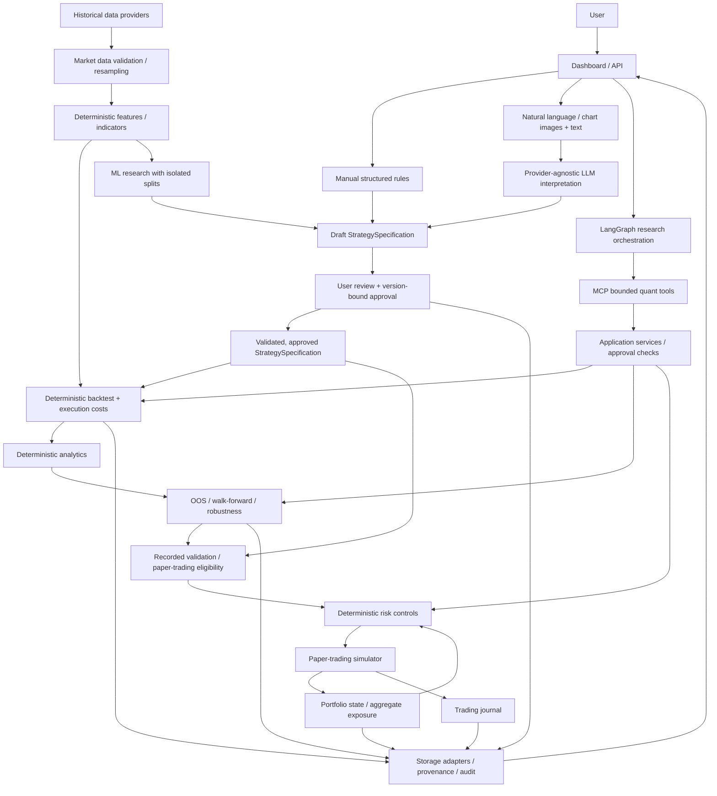

# Architecture

**Status: Phases 1–3 implemented; subsequent functional layers are planned.** This document is the current architectural source of truth. The existing implementation consists of the package/configuration foundation, market-data domain contracts, and the isolated Dukascopy historical quote-ingestion adapter described below. Layer names in the planned architecture describe responsibilities, not a complete module tree already present in the repository.

## Goals and boundaries

The platform will support reproducible quantitative research from human-authored ideas through historical testing, validation, and controlled paper trading. Users will supply structured rules, natural language, or one or multiple chart images with text explanations. Each route will converge on a common StrategySpecification before execution.

Forex is the first detailed market implementation. Instrument, timestamp, execution, currency, and data contracts must support later equities and crypto adapters without rewriting the core. The design favors a modular Python core with explicit interfaces; separate services are not required initially.

In scope for the planned first-generation platform: data ingestion and quality checks, strategy definitions, deterministic quant engines, research validation, ML experiments, AI-assisted interpretation, agent orchestration, MCP tools, risk, paper trading, portfolios, journaling, and a separate API/dashboard.

Outside current scope: real-money brokerage execution, autonomous strategy deployment, guaranteed profitability, and V2 self-evolving alpha research. Phases 2 and 3 implement market-data domain contracts and historical quote ingestion; the other functional layers remain unimplemented. AI output and screenshots are research inputs, not authoritative historical prices or approved execution instructions.

## Implemented Phase 2 contracts

The public contracts live in `src/quantlab/data/` and are exported by `quantlab.data`. They depend only on the standard library and Pydantic.

| Contract | Current responsibility |
| --- | --- |
| Instrument | Stable domain identity, symbol, asset class, quote/base currency labels, price/quantity increments, contract multiplier, and calendar reference. Forex requires distinct three-letter base/quote codes plus explicit pip and lot sizes; pip size cannot be smaller than tick size. |
| TradingCalendar | Calendar identity and descriptive IANA timezone label. This is a reference only: timezone resolution, session/holiday schedules, and calendar correctness are deferred to an adapter. |
| MarketBar | Complete OHLC observation with explicit price basis, timeframe label, half-open start/end interval, earliest availability time, source/dataset references, and optional volume with explicit units. |
| MarketQuote | Timestamped bid/ask observation with earliest availability time and instrument/source/dataset references. Locked quotes are accepted; crossed quotes are rejected. |
| Enums | AssetClass (Forex, equity, crypto), PriceType (bid, ask, mid, trade), initial Timeframe labels (1m, 5m, 15m, 30m, 1h, 4h, 1d, 1w), and VolumeType (base, quote, tick count). |

Models are immutable, reject extra fields, and use strict Python construction: callers supply Decimal values, datetime objects, and enum members. JSON serialization/validation supports their corresponding wire representations; see [Pydantic strict-mode semantics](https://docs.pydantic.dev/latest/concepts/strict_mode/). Currency labels are validated syntactically, not against a currency registry. Crypto codes may be longer than three characters; non-Forex instruments do not use pip/Forex-lot metadata.

All observation timestamps require timezone information and normalize to UTC. Preserve the source's timezone context separately through instrument/calendar metadata when needed. Bar availability cannot precede the end of its interval; quote availability cannot precede its observation timestamp. OHLC values must lie within low/high bounds, quotes require ask >= bid, and prices must be finite and positive for the initially supported asset classes. Negative-priced instruments would require an explicit future contract change.

Missing volume is None, distinct from zero. Supplied volume must be finite and nonnegative, accompanied by its unit type; tick-count volume must be integral. Quantity increments, pip sizes, lot sizes, and contract multipliers are metadata, not sizing or valuation calculations.

Timeframe labels do not generate schedules or enforce fixed elapsed durations: explicit bar endpoints support session/DST differences. Instrument and source/dataset identifiers are opaque references; lookup consistency, duplicate/gap detection, price-grid alignment, and dataset quality checks belong to later phases. Phase 3 adds historical quote ingestion through the provider boundary below. No resampling, calendar adapter, or storage implementation exists yet.

## Implemented Phase 3 ingestion

`quantlab.data.providers.base` defines a quote-only HistoricalQuoteRequest and HistoricalQuoteProvider protocol. Requests supply an Instrument plus timezone-aware start/end datetimes; inputs normalize to UTC and use **[start_time, end_time)**. The interface returns an iterator of canonical MarketQuote objects. It does not expose binary formats, provider symbols, bar requests, dataframes, or persistence to consumers.

The first concrete adapter is `quantlab.data.providers.dukascopy.DukascopyProvider`. It separates request validation, an injectable ByteFetcher transport, isolated binary decoding, and canonical-model translation. The standard-library HTTP transport uses urllib with a configurable finite timeout and bounded response reads. There are no credentials, retries, import-time requests, caches, or file writes on this selected public-data path.

### Selected format and support boundary

The [official historical-data guide](https://www.dukascopy.com/wiki/en/development/data-export/) describes the 20-byte big-endian tick fields and price scales, and warns about different hourly/daily time bases. The [official support archive](https://www.dukascopy.com/swiss/english/forex/jforex/forum/viewtopic.php?p=76043) records hourly public datafeed paths. **This adapter selects the public hourly archive, not the daily Requester Pays S3 layout currently described in the guide.** It does not guess a layout from payload contents or switch between variants.

- Endpoint: `https://datafeed.dukascopy.com/datafeed/{SYMBOL}/{YYYY}/{MM}/{DD}/{HH}h_ticks.bi5`. The month is zero-based; day/hour are conventional UTC fields.
- Accepted compression: one legacy LZMA-Alone stream (`lzma.FORMAT_ALONE`). XZ, headerless raw LZMA, trailing bytes, concatenated streams, and incomplete streams are rejected. Decompression has output and decoder-memory limits.
- Each decompressed record is `>IIIff`: uint32 milliseconds since the requested UTC hour began, uint32 ask, uint32 bid, float32 ask volume, float32 bid volume. A partial record or offset outside that hour is rejected.
- Initial explicit pair registry: EUR/USD → EURUSD with point size 0.00001; USD/JPY → USDJPY with point size 0.001. Other instruments/pairs are rejected until added explicitly.
- Canonical prices equal the native integer times Instrument.tick_size. The adapter requires that metadata to match the registered provider point size, so a coarser broker tick size cannot silently change prices. Scaling uses a fixed local Decimal context; it does not inspect display strings or assume a universal divisor.
- Provider volume fields are checked for finite, nonnegative values. They are not mapped because the existing MarketQuote contract has no volume fields; no Phase 2 model was changed.

These are the adapter's explicit accepted format assumptions. A small manual live probe received HTTP 429, so successful live compatibility was not verified during this phase. Offline tests establish the selected binary/transport contract; they do not establish endpoint uptime or complete historical coverage. Daily S3 ingestion and undocumented format variations remain unsupported.

### Canonical mapping, absence, and errors

Each tick maps to a MarketQuote with the requested instrument_id, Decimal bid/ask, and a timezone-aware UTC timestamp reconstructed from the hour plus the millisecond offset. The existing model enforces positive prices and ask >= bid. source_id is `dukascopy`; dataset_id includes the provider symbol, UTC file hour, and SHA-256 hash of the compressed payload. These are source references, not database IDs.

**Initial availability policy:** available_at equals the historical tick timestamp and represents source event availability. It does not represent download time or a guarantee of zero publication/network latency. Later live/paper-trading adapters and execution simulations must specify additional latency explicitly.

A transport result of None denotes an absent resource; the default transport returns it for HTTP 404. The adapter also treats an empty successful body or a valid zero-record stream as an explicit no-observation result. This is an ingestion policy, not proof of a weekend/holiday or a claim of complete coverage. Nothing is filled or fabricated. Nonempty corrupt payloads and invalid canonical quotes raise ProviderDataError, including malformed records outside the requested subrange of a downloaded hour.

HTTP/network failures raise ProviderTransportError with status/retryability information when available. HTTP 429 and 5xx are classified as retryable but are not automatically retried. Unsupported pairs or mismatched scale metadata raise ProviderConfigurationError before HTTP access. HTTP 403 is an error, not a missing dataset.

Fetching is lazy and visits only intersecting UTC hours. It preserves record order and duplicates without sorting or cleaning. Each file is fully decoded and mapped before any of its quotes are yielded; earlier hours may already have been emitted if a later hour fails. Consumers must treat exceptions as an incomplete request, not a successful sparse dataset.

### Licensing and next boundary

Users must comply with Dukascopy's applicable historical-data terms/licensing, including any restrictions on use or redistribution. Public accessibility does not automatically grant redistribution rights. Tests construct tiny synthetic binary payloads; no provider dataset is checked into the repository.

Phase 4 still owns dataset-wide quality checks, chronological/duplicate/gap validation, missing-period reports, resampling/OHLC aggregation, and normalized storage. This adapter has no dataframe processing, filesystem persistence, backtesting, or execution behavior.

## Planned system flow

Arrows represent information/control flow, not Python import direction. Every execution entry point, including internal application services and MCP tools, must enforce the same approval and risk rules. The diagram is conceptual; no network services or tools exist yet.

## Architectural layers

### Market data

Own canonical instrument metadata and time-indexed market observations, ingestion adapters, dataset provenance, and quality reports. Record provider, instrument identity, timestamp semantics, timezone, granularity, price type (bid, ask, mid, trade), units, and source/version identifiers.

Forex contracts must describe base/quote currencies, tick and pip sizes, trading calendar, and available bid/ask information. Core contracts should not assume every market uses pips, continuous sessions, or a particular lot size. Preserve raw input separately from normalized datasets; transformations must be traceable.

Normalize timestamps to timezone-aware UTC while preserving exchange/session calendar information. Detect duplicates, gaps, ordering errors, malformed OHLC values, and missing prices. Missing bars must not be silently invented. Resampling must define bar labels, interval closure, availability times, and treatment of partial bars so features cannot access unfinished candles.

Provider licensing and redistribution constraints belong to dataset metadata. Local research data is excluded from Git; public examples will require suitable redistribution rights.

### Strategy specification

A versioned, typed StrategySpecification will be the shared contract for manual, natural-language, image-derived, and future ML-informed proposals. Planned fields include instrument universe, timeframe, session filters, feature definitions, entry/exit conditions, sizing policy references, order timing, execution assumptions, parameters, and provenance.

Use a declarative rule representation with a bounded supported vocabulary. Never execute arbitrary model-generated Python, expressions through unsafe evaluation, or uploaded code. Reject unsupported rules and unresolved ambiguities rather than guessing executable semantics.

Separate schema validity from human approval and research eligibility. The intended lifecycle is draft → validated → approved → tested, with validation results and paper-trading eligibility attached to specific versions. Human approval confirms interpretation; it does not establish profitability or risk suitability.

Approval must identify the immutable specification version/content digest, reviewer, and review timestamp. Edits invalidate approval for the revised version. AI-origin drafts require explicit human approval before backtesting or paper trading. Image-derived drafts additionally retain the reviewed input bundle and interpretation record. Manual submissions will use the same review/approval contract for a consistent execution boundary.

### Features and indicators

Compute deterministic, timestamped features from validated historical observations. Document lookback windows, warm-up periods, missing-value handling, and the earliest time each output is available. Feature definitions are shared between backtesting, ML, and paper trading. Fitted transformations must carry their training window and artifact version.

### Backtesting and execution simulation

Turn an approved specification, versioned dataset, and explicit run configuration into deterministic orders, fills, positions, cash balances, and an equity curve. Separate signal formation from order submission and fill timing. An observation available only at bar close must not justify an earlier fill; same-bar execution requires a documented finer-grained observation model.

Execution policies will model bid/ask spread, slippage, fees, latency assumptions, order types, minimum sizes, tick/lot rounding, and market availability. Forex financing/rollover and currency conversion must be explicit when relevant. If both stop and target fall inside a bar and their order is unknown, use a documented conservative policy or reject the ambiguous scenario; do not infer a favorable path.

Research sizing and account constraints must be deterministic from the first engine iteration. A later reusable risk engine will centralize these controls before paper trading. Cost-free engine fixtures may test mechanics, but results cannot be presented as realistic research until the cost-model phase is complete.

### Performance analytics

Calculate P&L, returns, drawdown, trade statistics, exposure, and risk-adjusted metrics using deterministic code. Define valuation currency, annualization conventions, return frequency, financing and fee treatment, benchmark assumptions, and handling of undefined statistics. Preserve metric definitions and engine versions alongside values. An LLM may explain these results, but cannot replace or silently recompute them.

### Research validation

Own chronological out-of-sample splits, rolling/expanding walk-forward windows, parameter sensitivity, regime analysis, and session analysis. Train/validation/test separation applies where fitting or tuning occurs. Keep final holdouts isolated from iterative selection and record all tested candidates to make selection effects visible.

Guard against leakage by fitting preprocessing only on training windows, preventing labels or overlapping targets from crossing split boundaries, and using purge/embargo policies when required by label horizons. Regime definitions, session timezone/DST conventions, and tuning budgets must be explicit. Report robustness and uncertainty; no validation method guarantees future performance.

### ML research

Own reproducible feature/label construction, training, tuning, evaluation, and model artifact metadata. Begin with simple baselines and add scikit-learn, boosting libraries, Optuna, and tracking tools only as needed. Record seeds, dataset/split identities, hyperparameters, preprocessing state, and model versions.

ML predictions are inputs to an explicit strategy specification and deterministic execution/risk pipeline. A trained model is not an independently authorized trader. Model selection must use validation data; final test data cannot feed tuning or feature-selection loops.

### AI and multimodal interpretation

A provider-agnostic adapter will support text and vision requests with structured output validation. Record provider/model identifier, prompt version, relevant parameters, input provenance, interpretation output, and uncertainty. External provider selection, privacy policy, retention, and upload limits remain implementation decisions.

Treat chart uploads, extracted text, and provider responses as untrusted content. Uploaded text must never become privileged orchestration instructions. Validate file types and sizes at the future upload boundary and associate each image with its explanation. Multiple images form a versioned input bundle with explicit ordering/context.

Interpretation will expose chart observations, proposed rules, assumptions, unresolved ambiguities, and links between proposed rules and inputs. Screenshots do not supply reliable historical time series. Missing instrument, timeframe, entry/exit, or sizing semantics must remain unresolved until the user supplies them. All resulting proposals use StrategySpecification and the approval gate.

### LangGraph agents

Agents will coordinate research tasks, request tool operations, and explain persisted results. State should contain artifact/run references, bounded task progress, errors, and checkpoints. Define tool permissions, cancellation, retry limits, time/cost budgets, and human review checkpoints.

An agent cannot grant approval, change risk policy, deploy live trading, or promote an unreviewed strategy through a privileged route. Agents consume deterministic tool outputs with provenance instead of treating their own generated numbers as financial evidence.

### MCP and application tools

Expose narrow, typed operations over application services, such as loading approved specifications, starting backtests, querying run status, and retrieving computed analytics. Use validated schemas, permitted resource identifiers, explicit error responses, audit records, and idempotency for operations that create runs or simulated orders.

Do not expose arbitrary shell/code execution or an unrestricted database interface. Long-running work should return a run identifier and support status/cancellation. The same approval, authorization, and risk checks must apply whether a request arrives through MCP, the API, or a direct internal service.

### Deterministic risk

Own position sizing and policies for per-trade loss, leverage/margin, instrument concentration, aggregate exposure, daily loss, drawdown, and data freshness as those policies are implemented. Policies will be versioned and administered through explicit human-controlled configuration, never by an LLM-generated override.

Before every simulated order, evaluate current account/portfolio state and relevant policy limits. Denials must include machine-readable reasons. Missing or stale risk inputs fail closed; an engine failure is not permission to trade. Account state updates and checks must be coordinated so concurrent strategies cannot independently spend the same risk budget.

Hard limits apply after strategy sizing proposals. Stop controls must prevent new orders and document the treatment of pending orders/positions. Reusable risk policy interfaces support consistent backtest and paper-trading decisions while preserving execution-mode differences.

### Paper trading

Own simulated order lifecycle, fills, balances, positions, clock/feed integration, and event recovery. Entry requires an approved strategy version, recorded validation satisfying a declared eligibility policy, usable data, and current risk approval. Eligibility thresholds will be specified before this phase; historical validation is not a guarantee.

Use deterministic replayable execution rules, explicit simulated costs, duplicate-event/order handling, and journaled state transitions. Restart/reconciliation behavior and disconnect/stale-data handling must be tested before continuous use. No live broker adapter or real-money order path is part of the first-generation scope.

### Portfolio

Maintain multiple strategies and instruments, allocations, cash, valuation currency, currency conversions, and aggregate exposures. Attribute trades and P&L to strategies without losing the portfolio-wide view. Publish consistent portfolio state to the risk engine before execution and derive valuations from timestamped, provenance-bearing prices.

### Journal

Link strategy versions, approval records, research runs, simulated orders/fills, risk decisions, and human notes. Keep immutable execution/audit events distinct from editable annotations. Journal records will support reconciliation, attribution, and research review; an AI-written narrative cannot rewrite recorded fills or metrics.

### API/backend

A future FastAPI application will provide transport schemas, authentication/authorization when deployed, input validation, job control, and access to application services. Business rules remain in the Python core/services, not route handlers. The API must not expose credentials or permit clients to assert approval/eligibility without authorized transitions.

Introduce background workers only when workload demands them. Design request/run identifiers and error contracts before adding distributed infrastructure. CLI/tests and the API should invoke the same services rather than duplicate financial logic.

### Dashboard/frontend

A separate web interface will support strategy authoring/review, chart uploads, run comparison, validation results, risk visibility, paper-trading state, portfolios, and journaling. React/Next.js is a likely direction, not a final dependency decision.

Show draft versus approved state, historical versus simulated results, data ranges, execution assumptions, and run provenance. Review screens must display unresolved interpretation details and the exact version being approved. Display authoritative backend results; frontend formatting must not become a second financial calculation engine.

### Storage

Persist structured metadata, strategy versions, approvals, run configurations/results, risk policies, portfolios, and journal events through repository/storage interfaces. PostgreSQL is the planned relational direction once persistence requirements justify it. Historical tables and large images/model artifacts may use separate file/columnar/object storage; final formats remain open.

Prefer immutable dataset and artifact versions with identifiers/content hashes, explicit schema migrations, and traceable transformations. A reproducible run record should reference specification version, approval, dataset, feature/model artifacts, code version, cost/risk configuration, seeds, and output definitions.

Keep secrets and personal/local research artifacts out of Git. Structured logs should include run/correlation identifiers and redact credentials and sensitive uploaded content. Backup, retention, deletion, and access policies must be specified when storage is implemented.

## Dependency direction

- Domain contracts and deterministic calculations must not depend on FastAPI, dashboard code, LLM providers, LangGraph, MCP, or a specific database.
- Application services coordinate domain engines through explicit interfaces for data, storage, jobs, clocks, and execution.
- Provider, database, API, MCP, and agent integrations sit outside the core and depend on its contracts. Concrete adapters are wired at an application composition boundary.
- The frontend depends on the API contract. AI/agents depend on bounded services/tools; financial engines do not require an LLM to run.
- Approval and risk policies are enforced inside application/domain boundaries, so changing transport or model provider cannot bypass them.

These boundaries are conceptual now. Add concrete modules incrementally with tested behavior rather than generating an empty module for every layer.

## Safety and reproducibility invariants

| Concern | Required boundary |
| --- | --- |
| Authoritative financial values | Python engines compute indicators, signals, orders, fills, P&L, statistics, sizing, portfolio values, and risk. LLMs only interpret, reason, orchestrate, and explain. |
| Human review | Approval records bind to exact specification versions; interpreted drafts cannot run without explicit human approval. |
| Risk authority | Human-controlled deterministic policies cannot be overridden by AI, agents, tools, or frontend requests. |
| Look-ahead bias | Availability timestamps, feature warm-up, split boundaries, and fill timing enforce causality. |
| Unrealistic execution | Record price basis, spread, fees, slippage, financing, calendar, and intrabar ambiguity policies. |
| Overfitting/data leakage | Isolate holdouts, fit on training windows, record tuning histories, and use walk-forward/robustness evaluation. |
| Reproducibility | Version inputs, assumptions, code, schemas, models, and run artifacts; record stochastic seeds. |

These are planned acceptance requirements, not claims of implemented protections.

## Multi-market extensibility

Shared contracts will cover instrument identifiers, asset class, price/quantity increments, contract multipliers, currencies, calendars, timestamped observations, orders, fills, positions, and valuation. Market policies/adapters supply conventions:

- Forex: pip/lot conventions, bid/ask spread, rollover, base/quote conversion, and session boundaries.
- Equities: exchange calendars, corporate actions, adjusted versus raw prices, delistings/universe history, and short/borrow constraints.
- Crypto: continuous calendars, venue-specific sizes/fees, and funding/leverage rules for derivatives when supported.

These are future requirements, not market implementations. Avoid universal assumptions such as a fixed trading-day count, constant spread, USD valuation, or identical leverage rules.

## Future V2 extension points

Versioned strategy registries, provenance-bearing experiments, bounded orchestration, model artifacts, and deterministic tool contracts can later support automated candidate generation and alpha research. Any future evolution loop would still need isolated evaluation, budgets, human promotion policy, and unchanged risk authority.

Do not implement evolution loops, self-modifying code, autonomous promotions, or live execution now. V2 requires a separate proposal and scope decision after the first-generation platform is validated.

## Open decisions

Additional historical providers and provider-specific redistribution permissions; Pandas versus Polars; event-driven versus vectorized engine internals; historical storage formats; LLM providers and upload/privacy constraints; validation/eligibility thresholds; authentication model; frontend framework; and deployment topology remain open. Resolve each through a focused design decision when its phase begins and update this document with the resulting tradeoffs.
